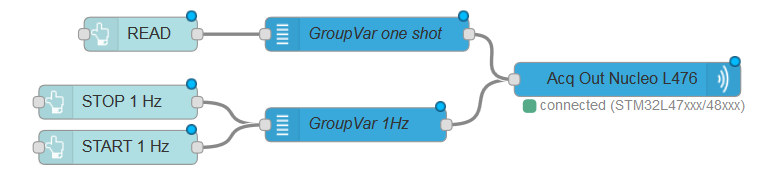

```bash
<script type="text/x-red" data-help-name="acquisition jlink out">
``` 

Allow to define and/or select a Jlink probe configuration (probe name), open and close the connection and send commands to the selected probe.

  

### Properties

Probe Configprobe configuration

This property allows to define and/or select a probe configuration (probe name)

Namestring

Name of the node in the flow, "acquisition out" if empty.

  

### Input

Each input msg will need a `topic` and a `payload` to be processed

topicstring

The `topic` possible values are

*   `read` to send a command of one shot read
*   `start` to send a command to START acquisition
*   `stop` to send a command to STOP acquisition

payloadobject

The `payload` is an object representing the variables group configuration defined in the variables node. The payload object holds several properties summarizing what have been set in the configuration panel of the variables node.

*   `groupname` string
*   `variablelist` array of variable

  

### Details

The acquisition out node is designed to be typically front linked with one or several variables nodes



--- 

```bash
<script type="text/x-red" data-help-name="acquisition jlink in">
``` 

Allow to define and/or select a Jlink probe configuration (probe name), and receive data from the selected probe.

  

### Properties

Probe Configprobe configuration

This property allows to define and/or select a probe configuration (probe name)

Namestring

Name of the node in the flow, "acquisition in" if empty.

  

### Output

Two outputs are defined, one port labelled `data` for the measurement and one labelled `error`

The `error` output `msg.payload` is the error message string, the `msg.topic` defines the error level

The `data` output `msg.payload` is an object representing the variable measurements done at specific intervals.

payloadobject

The payload object holds several properties:

*   `first` boolean, true when this is the first measurement after a start.
*   `groupname` string, the name of the 'variable group' these measurements are referring to.
*   `data` array of array of duplets
    Each array of duplets is referring to a variable. Each duplet represents the result of a single target memory read.*   `x` number, representing the timestamp
    *   `y` number, representing the read value in memory target

The following example shows an output `msg` for an acquisition in node:
```bash
      {
        "payload": {
          "data": \[
            \[
              {
                "y": 0,
                "x": 1560850927936
              }
            \],
            \[
              {
                "y": 0,
                "x": 1560850927936
              }
            \],
            \[
              {
                "y": 463,
                "x": 1560850927936
              }
            \],
            \[
              {
                "y": 2048,
                "x": 1560850927936
              }
            \],
            \[
              {
                "y": 78,
                "x": 1560850927939
              }
            \]
          \],
          "first": false,
          "groupname": "nv\_group2"
        }
      }
    
```
  

### Details

The acquisition in node is designed to be typically back linked with one or several processing nodes

