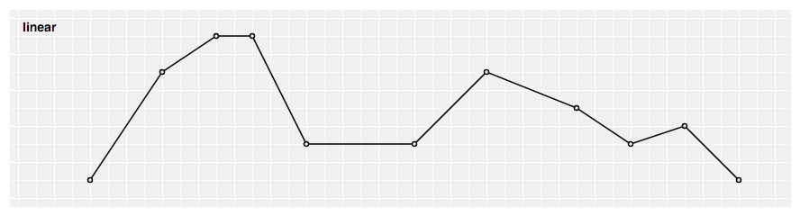
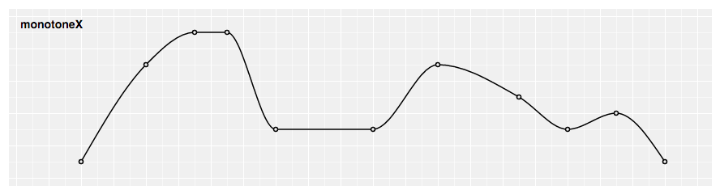
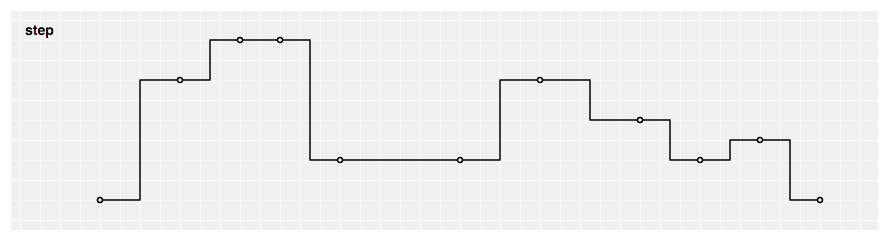
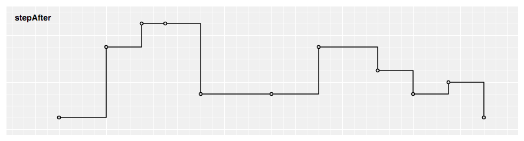
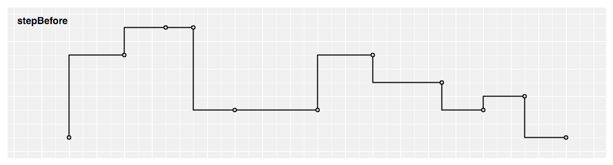
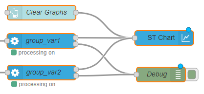

```bash
<script type="text/x-red" data-help-name="ui_chartst">
``` 

This node allows to plot input values on a chart. This chart can be a line chart or a bar chart.  
The line chart renders all the input values included in a time sliding window and the chart will auto-scale to any values received. Input values older than 1 hour are discarded to limit the memory consumption.  
The bar chart renders all the input values using vertical rectangular bars.  
For all charts, multiple series can be shown by using different `groupname`/`variablename` values on each input message (see section `Input` for more details).  
The chart can also render one data log performed during previous monitoring session.  
A set of 10 colors is available to render `groupname`/`variablename` values.  

  

### Properties

GroupDashboard group

Allows to define the dashboard group in which the chart will be rendered.

Size(width x height) or auto

Allows to specify the chart size in:

*   `Fixed mode` In that case, you specify the width and height of the chart with fixed numbers of units.
*   `Auto mode` In this case, the chart will fill the width of the dashboard group. The chart height will be automatically set as half of width value.

Chart typelist box

Allows to specify the chart type:

*   `Line chart`Produces a line chart.
*   `Bar chart`Produces a bar chart.

Curve typelist box

Allows to specify the line chart type:

*   `linear`Produces a polyline through the specified points.

          
        

*   `monotoneX`Produces a cubic spline that preserves monotonicity in y, assuming monotonicity in x a smooth curve with continuous first-order derivatives that passes through any given set of data points without spurious oscillations.

          
        

*   `natural`Produces a natural cubic spline with the second derivative of the spline set to zero at the endpoints.

          
        

*   `step`Produces a step line consisting of alternating horizontal and vertical lines. The y-value changes at the midpoint of each pair of adjacent x-values.

          
        

*   `step after`Produces a step line consisting of alternating horizontal and vertical lines. The y-value changes after the x-value.

          
        

*   `step before`Produces a step line consisting of alternating horizontal and vertical lines. The y-value changes before the x-value.

          
        

Durationsecond(s)

Allows to define the time sliding window duration in seconds for a line chart. The minimal value is 1s. Default is 10s if no value set.

Y-Axisnumber

Allows to define the Y axis lower and upper bounds for a bar chart.  
If the min and/or max value(s) is (are) not set, the bar chart will autoscale to any values received (with the 0 value centered in the middle of the graph).

Namestring

Name of the node in the flow, "Chart" if empty.

  

### Input

Each input `msg` requires a `topic` and a `payload` to be processed:

topicstring

The `topic` value is set to:

*   `data` to render monitored data in ST line chart
*   `clear` to clear and reset ST line chart

payload (for `topic``data`)object

The `payload` contains:

*   `groupname` string
*   `variablename` string
*   `variabledata` array of data

*   `coordinates` coordinate object

*   `x` number
*   `y` number

The following example shows an input `msg` for a chart node for the variable "var1" :
```bash
      {
        "topic":"data",
        "payload":
        {
          "groupname": "groupname1",
          "variablename": "var1",
          "variabledata": \[
            {
              "x": "0",
              "y": "1231"
            },
            {
              "x": "1",
              "y": "12"
            },
            {
              "x": "2",
              "y": "3615"
            }
          \]
        }
      }
 ```   

  

### Chart node in flow

The chart node is designed to be typically:

*   Front linked with one (or several) processing node(s)
*   Button(s) to clear and reset the chart

        
      

  

### Chart main buttons

The chart provides several buttons:

*   `Show All` button: Allows to render all input values since the beginning of the monitoring session for a line chart or the last input value for a bar chart.
*   `Zoom` / `Brush` button: Allows to select the `Zoom` mode or the `Brush` mode:

*   `Brush` mode: this is the default mode after deploying the dashboard. And you can go back in the `Brush` mode by clicking on "Brush" button. For the line chart, this mode allows to select one two-dimensional region in order to zoom-in that region. For the bar chart, this mode allows to select one-dimensional region along the y-dimension in order to zoom-in that region. The region selection can be performed by pressing the left mouse button, then brushing the region and finally releasing the left mouse button.
*   `Zoom` mode: You can go in the `Zoom` mode by clicking on "Zoom" button. This mode allows to zoom and pan in the chart. Zoom can be performed by spinning the mouse wheel. Pan can be performed by clicking-and-dragging.

*   `Show Points`  
    *   For a line chart, allows to render each input value with a dot. For each variable, dots will be rendered as soon there are less than 200 input values to be displayed. Input values information (variable name, x-value and y-value) is displayed for points whose x value is closest to the mouse pointer.
    *   For a bar chart, allows to render each input value(s) above/below bar(s).
*   Each`variablename` button: Allows to hide or display inputs values related to the `variablename` on the chart.
*   `Import data ...` button: Allows to render on the chart one data log previously done. One acquisition can be splitted into several files of maximum 100MB size each.  
    The number of generated files for one acquisition will be related to :
    
    *   Number of monitored variables.
    *   Acquisition frequency.
    *   Log type ( all values or only changes ).
    
    For example :
    *   1 generated file for an acquisition of 1 variable during 25 hours at 10 Hz.
    *   4 generated files for an acquisition of 10 variables during 2 hours with an ST LINK V3 in sequential loop.The directory path where you can find the log files could be configured in settings.js file ( default path is home directory / log ).
  
