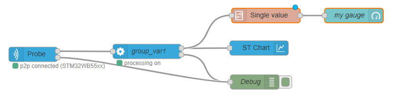

```bash
<script type="text/x-red" data-help-name="processing">
``` 

Transform each input message representing one measurement of a group of variables into one message every 50 ms per variable containing one or several duplets (x and y). It is also possible to define expressions and statistics based on those individual measurements and log options.

  

### Properties

Group NamePick List

Name of the variables nodes to be processed.

Log dataPick List

The acquisition is recorded in the file system on server side under a predefined directory path.  
The recorded data are stored in at least one file. If needed several files of maximum 100MB size each are created to store all the data for a single acquisition.The log files names follow the following convention : "Log\_groupname\_timestamp.extension". Extension depends on choosen log format.  
The number of generated files for one acquisition will be therefore related to :

*   Number of monitored variables.
*   Acquisition frequency.
*   Log type ( all values or only changes ).

For example :

*   1 generated file for an acquisition of 1 variable during 25 hours at 10 Hz.
*   4 generated files for an acquisition of 10 variables during 2 hours with an ST LINK V3 in sequential loop.

The directory path where you can find the log files could be configured in settings.js file ( default path is home directory / log ).

Log mode selection:

*   `No log` Values are not logged.
*   `Log all values` All the values read are logged.
*   `Log only changes` Only the changes for each variable are logged.

Log format selection:

*   `stcm` Log in a proprietary json like format.
*   `csv (one column)` Log in a csv (comma-separated values) format.
*   `csv (multiple columns)` Log in a csv format with variables organized in columns.

OutputsList

List summarizing the variables and post-processing data which will have there specific messages sent on the node output. From this list it is possible to remove (by using the "cross" button) or edit (by clicking on the line) a post-processing output.

Post-processingExpression | Statistic

It is possible to add some outputs by doing some post processing calculation on variables.

Expression

Expression variables are the result of a mathematical expression evaluation. An expression is the combination of standard (coming from "variables" node) or statistical variables and mathematical operators (+,-,\*, /…). Note that expression variables are evaluated after statistical variables, thus it is not possible to compute statistics on expressions.

Expression name string

The name of the expression to be addedd in output list

Formula string

A string representing a mathematical formula. The validity of the formula is checked once "+ add" button is clicked.

Possible variables in formula Pick List

The "Possible variables in formula" field could be used to write out the formula. By clicking on a line, the corresponding variable is automatically inserted in formula field.

Operations Pick List

The first field allows to select the operation category among `Mathematical`, `Trigonometry`, or `Logical`.

The second field is the list of operations. By clicking on a line, the corresponding operation is automatically inserted in formula field.

Statistic

Statistical variables can compute values like min, max, average and standard deviation of standard variables (coming from "variables" node).

Statistic name string

The name of the statistic to be added in output list and in "Possible variables in formula" field

Variable string

A string representing a mathematical formula. The validity of the formula is checked once "+ add" button is clicked.

Possible variables in formula Pick List

The "Possible variables in formula" field could be used to write out the formula. By clicking on a line, the corresponding variable is automatically inserted in formula field.

Operations Pick List

The first field allows to select the operation category among `Mathematical`, `Bitwise`, `Trigonometry` or `Logical`.

The second field is the list of operations. By clicking on a line, the corresponding operation is automatically inserted in formula field.

### Input

payloadobject

payload is an object representing the variables measurement. The payload object holds several properties:

*   `first` boolean, true when this is the first measurement after a start to allow creation of a new log file.
*   `groupname` string, representing the name of the selected "variables" node
*   `data` array of duplet, each representing a target memory access. The index of the duplets in the array, is the same as the order of the variables in "Variable list" field of "variables" node

*   `x` number, the value read from memory target
*   `y` number, the timestamp at which the value has been read

The following example shows an input `msg` for processing node:
```bash
        {
          "payload": {
            "data": \[
              \[
                {
                  "y": 0,
                  "x": 1559722981321
                }
              \],
              \[
                {
                  "y": 0,
                  "x": 1559722981321
                }
              \],
              \[
                {
                  "y": 463,
                  "x": 1559722981321
                }
              \],
              \[
                {
                  "y": 2048,
                  "x": 1559722981321
                }
              \]
            \],
            "first": true,
            "groupname": "nv\_group2"
          },
        }
 ```   

  

topicobject

A message with `topic` set to `clear` will reset the log timestamp to zero.

  

### Output

Two outputs are defined, one port labelled `data` for the measurement and one labelled `error`.

The `error` output `msg.payload` is the error message string, the `msg.topic` defines the error level.

for `data` output `msg.payload` is an object representing the variable measurements.

For each variable, expression, and statistic, the `msg` object holds:

topicstring

The `topic` value is set to `data`.

payloadobject

The `payload` is an object representing a set of measurement for a single variable from one group :

*   `groupname` string, the name of the group the `variabledata` is referring to.
*   `variablename` string, the variable name the `variabledata` is referring to.
*   `variabledata` array of duplets

*   each duplet object represents a single measurement and holds :

*   `x` number, representing the timestamp
*   `y` number, representing the read value in memory target

The following example shows an output `msg` for a processing node :
```bash
        {
          "topic":"data",
          "payload":
          {
            "groupname": "groupname1",
            "variablename": "var1",
            "variabledata": \[
              {
                "x": "0",
                "y": "1231"
              },
              {
                "x": "1",
                "y": "12"
              },
              {
                "x": "2",
                "y": "1565"
              }
            \]
          }
        }
 ```   

  

### Details

The processing node is designed to be typically :

*   front linked with an acquisition in node

**Warning: front link `processing` node with only one `acquisition` in node !** Using the same `variable` node to send configuration to several `acquisition out` nodes and linking the different `acquisition in` nodes to only one `processing` node leads to mixing the data coming from different probes as there is no discriminating information.

 *   back linked with a STChart node or a 'single value' subflow node.

