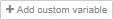

```bash
<script type="text/x-red" data-help-name="exe-config">
``` 

Configuration for an executable file.

This configuration node will allow to predefine a list of variables to be imported in variables nodes. This predefined list of variables is extracted from an executable file. As it is a configuration node, the same configuration is available to all variables nodes.

### Properties

Folderstring

The folder path located in the backend where to look for the list of executable files. All the files with .elf, .out or .axf extension present in the defined folder will be listed.

Filestring

Allow to select a specific executable file among a list of files available in the selected folder.

Namestring

the name of the configuration (selected variables) which will be available across all variables nodes

Expand Variable Listboolean

Check box to expand to the full list of available variables in the executable file, or restrict the list of variables to first element of array and first level of structure.

To avoid "heap out of memory" exception, expanding very large arrays will be limited up to the first 10000 elements maximum. For instance, expanding an array\[250000\] will result in displaying the elements array\[0\] to array\[9999\]. For convenience reason, the last element array\[2499999\] is also displayed.

Variable Listarray

The list of imported variables from the executable file. Only the ones marked as checked will be imported in variables node. To ease the variables selection out of the table, it is also possible to sort by columns, filter, and (de)select all.

---

```bash
<script type="text/x-red" data-help-name="variables">
``` 

Allow to configure a variables group holding a set of variables and few additional parameters useful for the communication with the target.

  

### Properties

Group Namestring

The group name must be unique across all the variables nodes.

Access portnumber

The access port number of STM32 core for which the group of variables applied. The default value is 0.

Executableexe-config

This optional property allows to select or define a new exe-config node. Once selected or defined, the variables selected in exe-config node are automatically added in the Variable list. Changing the selection from one config to another will automatically remove previous added variables coming from the exe-config from the Variable list and add the new ones from the new configuration. Of course, if "Add new exe-config ..." option is selected then no new variable is added, but the variables from previous selection will be removed from the list. As the exe-config node is a configuration node, the various exe-config configurations are shared across all variables nodes.

Variable list array

The Variable list summarizes the list of variables in the scope of this "variables" group node. It can filled by either selecting an Executable configuration (refer above) or by manually adding some custom variables by using  button. A variable is defined by its name (unique string), its base address (in hexadecimal), and its type (one of `Unsigned 8-bit`, `Signed 8-bit`, `Unsigned 16-bit`, `Signed 16-bit`, `Unsigned 32-bit`, `Signed 32-bit`, `Float`, `Double`).  
As the variable name must be unique, in case several variables with the same name have been entered or imported in this list, only the first one is kept when the configuration panel is validated (when the Done button is hit).  
It is possible to delete the custom variable individually from the list by using the  button or all in a row by hitting the  button.

Sampling frequency string

Defines the frequency at which the variables are read-out from the memory target.

*   `sequential loop` to perform the acquisition as fast as possible (best effort)
*   `0.1Hz`
*   `1Hz`
*   `10Hz`
*   `100Hz`
*   `1000Hz`
*   `Custom (in Hz):` to perform the acquisition at a specified frequency not present in predefined list (must be higher than 0)

Acquisition mode string

The acquisition (i.e. reading the variables in memory target) can be done in 2 different modes:

*   `direct` mode is a non-intrusive way to read-out data from memory-mapped areas into the target memory space, by using the JTAG or SWD protocols. However, due to the intrinsic latency between two memory accesses using those protocols, it is not possible to guarantee a time-synchronization between the values of different target memory areas.
*   `snapshot - Header address` The snapshot mode is an intrusive way to read-out data from memory-mapped areas into the target memory space in a time-synchronized way, by involving the target processor itself through a dedicated interrupt-driven target firmware block called “Snapshot FW”. This Snapshot FW (provided by STMicroelectronics) has to be added to the target FW and mapped to an interruption used for communication purposes with the Host machine. In this mode, the Snapshot FW is informed by the Host machine of a list of memory areas to be sampled at once (hence the “Snapshot” name) and copied into a dedicated buffer. When Snapshot FW is ready, this buffer is then read-out from the target into the Host machine by using the regular JTAG or SWD protocols, and the different memory values are extracted from it.
    *   `Header address` This field specifies the start address of “g\_traceHeader” variable in the Snapshot FW (address of “g\_traceHeader.startMark\[0\]”). The address can be found in the application map file, or obtain it by pressing the "import from executable" button. A popup message "\[SNAPSHOT MODE\] : Default Start Header Address not present in executable configuration. Please select another configuration or change to Direct acquisition mode." appears when the executable file doesn't contain the "g\_traceHeader.startMark\[0\]" variable name.

Trigger start mode string

The acquisition triggerring is settable in direct mode as in snapshot mode. Nevetheless, the snapshot mode needs adding the acqTrigger source code in the embeded part.

*   `off` The acquisition starts immediately after pressing the start button.
*   `rising edge` The acquisition starts when a sequence of two consecutive records is found where:
    *   In the first record, the trigger value is strictly below a specified threshold.
    *   In the second record, the trigger value is equal or greater than the specified threshold.
*   `falling edge` the acquisition starts when a sequence of two consecutive records is found where:
    *   In the first record, the trigger value is strictly greater than a specified threshold.
    *   In the second record, the trigger value is equal or lower than the specified threshold.

Trigger name string

Selection of the trigger, the list of triggers is from the variable list.

Trigger threshold string

Fill with the value of the threshold level according to the type of variable selected.

  

### Input

Each input msg will generate a msg to be send-out by the variables node. Although there is no specific requirement on input msg, the `topic` might be used:

topicstring

If present, the `topic` is transmitted as is on output msg `topic`. Usually, the `topic` holds an action to be passed to Acquisition out node. Please refer to Acquisition out node for a comprehensive list of possible actions.

  

### Outputs

Two outputs are defined, one port labelled data for the measurement and one labelled error.

The error output is used to inform user of errors or changes in the configuration. The `msg.topic` defines the error title, the `msg.payload` is a string with information.

The output `msg` object holds:

topicstring

The `topic` is set to the value found in incoming `topic` msg. Usually it holds an action to be passed to Acquisition out node. Please refer to Acquisition out node for a comprehensive list of possible actions.

payloadobject

The `payload` is an object representing the variables group configuration define by this node properties. The payload object holds several properties summarizing what have been set in the configuration panel.

*   `groupname` string
*   `variablelist` array of variable
*   `mode` string
*   `snapshotheader` string
*   `frequency` number (0 for sequential loop)
*   `accesspoint` number (access port)

The following example shows an output `msg` for a variables nodes named group1 which contains 3 variables to read out at 100Hz on access port 0 in direct mode:
```bash
      {
        "topic":"START",
        "payload":
        {
          "groupname":"group1",
          "variablelist":
            \[
              {"name":"myvar","imported": "false","address":"0x08888888","type":7},
              {"name":"counterU8","imported": "true","address":"0x20000090","type":1},
              {"name":"counterS8","imported": "true","address":"0x20000091","type":2}
            \],
          "mode":"direct",
          "snapshotheader":"0x200008c4",
          "frequency":100,
          "accesspoint":0
        }
      }
``` 

  

### Details

The variable node is designed to be typically :

*   front linked with an inject node or a button in which the topic has been optionally set
*   back linked with either an acquisition out node or a write node

