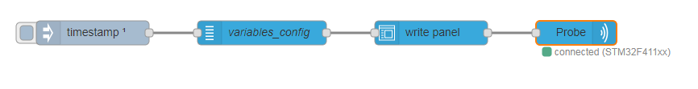
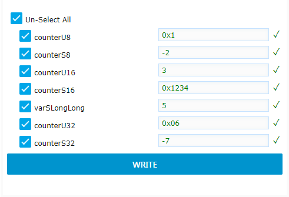

```bash
<script type="text/x-red" data-help-name="ui_write">
``` 

Add a "write" widget to the dashboard

### Properties

GroupDashboard group

Allows to define the dashboard group in which the Write widget will be rendered.

Size(width x height) or auto

Allows to specify the Write widget size in:

*   `Fixed mode` In that case, you specify the width and height of the widget with fixed numbers of units (a unit is 48px wide by default with a 6px gap).
*   `Auto mode` In this case, the width will fill the width of the dashboard group.

Namestring

Name of the node in the flow.

  

### Input

The input msg represents a group of variables to be displayed in the Write widget. It has to be received only once when the flow is deployed. The payload can be set manually using an inject node or set with the "variables" node. If set manually, the `payload` property must be formatted in the following way to be processed

payloadobject

The `payload` object holds several properties:

*   `groupname` string
*   `variablelist` array of variables
each holding following properties:

*   `name` variable name
*   `address` variable address
*   `type` number from 1 to 10 representing the variable type ( `1: Unsigned 8-bit`, `2: Signed 8-bit`, `3: Unsigned 16-bit`, `4: Signed 16-bit`, `5: Unsigned 32-bit`, `6: Signed 32-bit`, `9: Float`, `10: Double`).

*   `accesspoint` number (access port)

The following example shows an input msg `payload` for a write widget node :
```bash
          {
            "groupname": "nv\_group",
            "variablelist": \[
              {
                "name": "counterU8",
                "address": "0x20000090",
                "type": 1
              },
              {
                "name": "counterS8",
                "address": "0x20000091",
                "type": 2
              },
              {
                "name": "counterU16",
                "address": "0x20000128",
                "type": 3
              },
              {
                "name": "counterS16",
                "address": "0x2000012a",
                "type": 4
              },
              {
                "name": "counterU32",
                "address": "0x20000178",
                "type": 5
              },
              {
                "name": "counterS32",
                "address": "0x2000017c",
                "type": 6
              }
            \],
            "accesspoint": 0
          }
```     

  

### Output

The output `msg` object holds following properties:

topicstring

The `topic` is automatically set to "write" command. This "write" topic is processed by acqOut node to actually send the write command to the target.

payloadobject

The `payload` is an array representing the list of variables to display in the widget (in dashboard mode). Each variable holds several properties:

*   `name` string representing the name of the variable
*   `address` string representing the start address of the variable
*   `type` number from 1 to 10 representing the variable type (one of `Unsigned 8-bit`, `Signed 8-bit`, `Unsigned 16-bit`, `Signed 16-bit`, `Unsigned 32-bit`, `Signed 32-bit`, `Float`, `Double`).
*   `value` string representing the value to write either in hexadecimal (starting by 0x or 0X) or in decimal

The following example shows an output `msg` for a write widget node:
```bash
        {
          "payload": \[
            {
              "name": "counterU8",
              "address": "0x20000090",
              "type": 1,
              "value": "0x1"
            },
            {
              "name": "counterS8",
              "address": "0x20000091",
              "type": 2,
              "value": "-2"
            },
            {
              "name": "counterU16",
              "address": "0x20000128",
              "type": 3,
              "value": "3"
            },
            {
              "name": "counterS16",
              "address": "0x2000012a",
              "type": 4,
              "value": "0x1234"
            },
            {
              "name": "counterU32",
              "address": "0x20000178",
              "type": 5,
              "value": "0x06"
            },
            {
              "name": "counterS32",
              "address": "0x2000017c",
              "type": 6,
              "value": "-7"
            }
          \],
          "topic": "write",
        }
```     

  

### Details

The write widget node is designed to be linked with a "variables" node on its "in" port, and with "acq out" node its "out" port



Once deployed, a write widget is displayed in the dashboard presenting a list of variables (name, address, type) coming from the input msg. The end user can then fill some values for each variables and click on WRITE button to actually write the values in the memory target.




