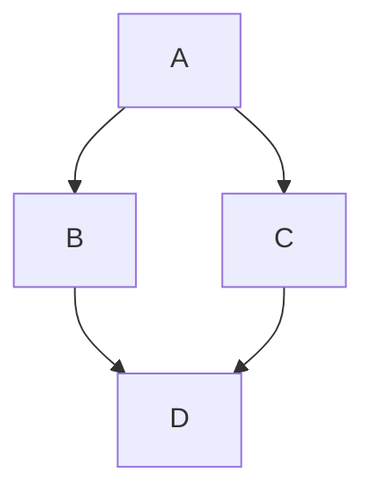

import Tabs from "@theme/Tabs";
import TabItem from "@theme/TabItem";
import {LABsApoio} from '@site/src/components/AvisosSite';
import LabFromTemplate from "@site/src/components/LabFromTemplate";
import {VerifyDev1,VerifyDev2,GitConfig,STM32Tools,DevToolsv2,GitCommit} from '@site/src/components/InstructionsSite';
import LabTable from '@site/src/components/LabTable';

# Laboratório 01

<!-- Info de que este conteúdo é de apoio! -->
<LABsApoio />

<!-- Tabela com link para atividade, inicio, fim e descrição do LAB! -->
<div style={{ display: "flex", justifyContent: "center" }}>
  <LabTable index={1} internal={false} />
</div>

---

## Conteúdo

Git e GitHub; Ambiente de desenvolvimento;

- [ ] Uso do Git;
- [ ] Uso do GitHub;
- [ ] Crie uma organização no GitHub;
- [ ] Adicione os membros do seu grupo;
- [ ] Promova o professor como owner;
- [ ] Ambiente de desenvolvimento;
- [ ] Comandos básicos, git e GitHub;


## Verifique o seu ambiente de desenvolvimento

<!-- List of Dev Tools -->
<DevToolsv2 />

---

<!-- Configure o git -->
<GitConfig />

---

<!-- Verifique o seu ambiente dev, git, gh e code -->
<VerifyDev1 />

---

## Crie um novo repositório com base no template do LAB01

Escolha o Grupo e entre com o comando abaixo para criar o repositório no GitHub:

<!-- Gera instruções para criar o repositório no GitHub por grupo com base no template do laboratório. -->
<LabFromTemplate labNumber="LAB01" opts="-c" />

<!-- Git Commit -->
<GitCommit />

## Git e GitHub

- [ ] Definições;
- [ ] Uso do GitHub;
  

O GitHub é uma plataforma de hospedagem de código-fonte e arquivos com controle de versão usando o Git.

- https://docs.github.com/pt/get-started/learning-about-github/github-glossary


### [Git](https://git-scm.com/)

| Git                                                                                                                                                                                                                                           | Git                                                                                                                                                                                                                      |
| --------------------------------------------------------------------------------------------------------------------------------------------------------------------------------------------------------------------------------------------- | ------------------------------------------------------------------------------------------------------------------------------------------------------------------------------------------------------------------------ |
| O Git é um programa de código aberto para acompanhamento de alterações em arquivos de texto. Ele foi escrito pelo autor do sistema operacional Linux e é a principal tecnologia na qual o GitHub, a interface social e do usuário, se baseia. | Git is an open source program for tracking changes in text files. It was written by the author of the Linux operating system, and is the core technology that GitHub, the social and user interface, is built on top of. |

### repository

| Repositório                                                                                                                                                                                                                                                                                                              | Repository                                                                                                                                                                                                                                                                                               |
| ------------------------------------------------------------------------------------------------------------------------------------------------------------------------------------------------------------------------------------------------------------------------------------------------------------------------ | -------------------------------------------------------------------------------------------------------------------------------------------------------------------------------------------------------------------------------------------------------------------------------------------------------- |
| Um repositório é o elemento mais básico do GitHub. É mais fácil imaginá-lo como uma pasta de projetos. Um repositório contém todos os arquivos de projeto (incluindo a documentação) e armazena o histórico de revisão de cada arquivo. Os repositórios podem ter vários colaboradores e podem ser públicos ou privados. | A repository is the most basic element of GitHub. They're easiest to imagine as a project's folder. A repository contains all of the project files (including documentation), and stores each file's revision history. Repositories can have multiple collaborators and can be either public or private. |


### commit

git-commit - Record changes to the repository

| confirmar                                                                                                                                                                                                                                                                                                                                                                                                                                       | commit                                                                                                                                                                                                                                                                                                                                                                            |
| ----------------------------------------------------------------------------------------------------------------------------------------------------------------------------------------------------------------------------------------------------------------------------------------------------------------------------------------------------------------------------------------------------------------------------------------------- | --------------------------------------------------------------------------------------------------------------------------------------------------------------------------------------------------------------------------------------------------------------------------------------------------------------------------------------------------------------------------------- |
| Commit, ou "revisão", é uma alteração individual em um arquivo (ou conjunto de arquivos). Quando você faz um commit para salvar seu trabalho, o Git cria uma ID exclusiva (também conhecida como o "SHA" ou "hash") que permite que você mantenha o registro das alterações específicas confirmadas com quem as fez e quando. Os commits normalmente contêm uma mensagem do commit, que é uma breve descrição de quais alterações foram feitas. | A commit, or "revision", is an individual change to a file (or set of files). When you make a commit to save your work, Git creates a unique ID (a.k.a. the "SHA" or "hash") that allows you to keep record of the specific changes committed along with who made them and when. Commits usually contain a commit message which is a brief description of what changes were made. |


```bash
git help commit
```

### pull

| pull                                                                                                                                                                                                                                                                 | pull                                                                                                                                                                                                                                                     |
| -------------------------------------------------------------------------------------------------------------------------------------------------------------------------------------------------------------------------------------------------------------------- | -------------------------------------------------------------------------------------------------------------------------------------------------------------------------------------------------------------------------------------------------------- |
| Pull refere-se a quando você busca alterações e as mescla. Por exemplo, se alguém editou o arquivo remoto no qual vocês dois estão trabalhando, o ideal é fazer pull dessas alterações na cópia local para que ele fique atualizado. Confira também [fetch](#fetch). | Pull refers to when you are fetching in changes and merging them. For instance, if someone has edited the remote file you're both working on, you'll want to pull in those changes to your local copy so that it's up to date. See also [fetch](#fetch). |

```bash
git help pull
```

### fetch

| fetch                                                                                                                                                                                                                                                  | fetch                                                                                                                                                                                                                                  |
| ------------------------------------------------------------------------------------------------------------------------------------------------------------------------------------------------------------------------------------------------------ | -------------------------------------------------------------------------------------------------------------------------------------------------------------------------------------------------------------------------------------- |
| Ao usar `git fetch`, você está adicionando alterações do repositório remoto ao branch de trabalho local sem fazer commit delas. Ao contrário de `git pull`, a busca permite que você revise as alterações antes de fazer commit delas no branch local. | When you use `git fetch`, you're adding changes from the remote repository to your local working branch without committing them. Unlike `git pull`, fetching allows you to review changes before committing them to your local branch. |

```bash
git help fetch
```

### clone

git-clone - Clone a repository into a new directory

| clone                                                                                                                                                                                                                                                                                                                                                                                                                                                                                                                            | clone                                                                                                                                                                                                                                                                                                                                                                                                                                                    |
| -------------------------------------------------------------------------------------------------------------------------------------------------------------------------------------------------------------------------------------------------------------------------------------------------------------------------------------------------------------------------------------------------------------------------------------------------------------------------------------------------------------------------------- | -------------------------------------------------------------------------------------------------------------------------------------------------------------------------------------------------------------------------------------------------------------------------------------------------------------------------------------------------------------------------------------------------------------------------------------------------------- |
| Um clone é uma cópia de um repositório que fica em seu computador em vez de ficar em algum outro lugar em um servidor de site. Clonar significa o ato de fazer essa cópia. Quando você faz um clone, é possível editar os arquivos no seu editor preferido e usar o Git para acompanhar as alterações sem precisar ficar online. O repositório clonado ainda está conectado à versão remota, ou seja, você poderá enviar as alterações locais por push ao repositório remoto para mantê-las sincronizadas quando estiver online. | A clone is a copy of a repository that lives on your computer instead of on a website's server somewhere, or the act of making that copy. When you make a clone, you can edit the files in your preferred editor and use Git to keep track of your changes without having to be online. The repository you cloned is still connected to the remote version so that you can push your local changes to the remote to keep them synced when you're online. |

```bash
git help clone
```

### push

git-push - Update remote refs along with associated objects

| efetuar push                                                                                                                                                                                                                          | push                                                                                                                                                                                         |
| ------------------------------------------------------------------------------------------------------------------------------------------------------------------------------------------------------------------------------------- | -------------------------------------------------------------------------------------------------------------------------------------------------------------------------------------------- |
| Enviar por push significa enviar as alterações confirmadas para um repositório remoto no GitHub.com. Por exemplo, se você alterar algo localmente, poderá enviar por push essas alterações para que outras pessoas possam acessá-las. | To push means to send your committed changes to a remote repository on GitHub.com. For instance, if you change something locally, you can push those changes so that others may access them. |

```bash
git help push
```

### branch

git-branch - List, create, or delete branches

| branch                                                                                                                                                                                                                                                                                                                                                   | branch                                                                                                                                                                                                                                                                                                                               |
| -------------------------------------------------------------------------------------------------------------------------------------------------------------------------------------------------------------------------------------------------------------------------------------------------------------------------------------------------------- | ------------------------------------------------------------------------------------------------------------------------------------------------------------------------------------------------------------------------------------------------------------------------------------------------------------------------------------ |
| Um branch é uma versão paralela de um repositório. Está no repositório, mas não afeta a ramificação principal ou primária e permite que você trabalhe à vontade, sem prejudicar a versão "online". Depois de fazer as alterações desejadas, você poderá fazer uma mesclagem do branch novamente com a ramificação principal para publicar as alterações. | A branch is a parallel version of a repository. It is contained within the repository, but does not affect the primary or main branch allowing you to work freely without disrupting the "live" version. When you've made the changes you want to make, you can merge your branch back into the main branch to publish your changes. |

```bash
git help branch
```


### checkout 

git-checkout - Switch branches or restore working tree files

| fazer checkout                                                                                                                                                                                                                                                                                                                                                                                                                                                             | checkout                                                                                                                                                                                                                                                                                                                                                                                                                                                              |
| -------------------------------------------------------------------------------------------------------------------------------------------------------------------------------------------------------------------------------------------------------------------------------------------------------------------------------------------------------------------------------------------------------------------------------------------------------------------------- | --------------------------------------------------------------------------------------------------------------------------------------------------------------------------------------------------------------------------------------------------------------------------------------------------------------------------------------------------------------------------------------------------------------------------------------------------------------------- |
| Use `git checkout` na linha de comando para criar um branch, alterar o branch de trabalho atual para outro branch ou até alternar para uma versão diferente de um arquivo de outro branch com `git checkout [branchname] [path to file]`. A ação de "check-out" atualiza toda ou parte da árvore de trabalho com um objeto de árvore ou um blob do banco de dados de objetos e atualiza o índice e o HEAD se toda a árvore de trabalho está apontando para um novo branch. | You can use `git checkout` on the command line to create a new branch, change your current working branch to a different branch, or even to switch to a different version of a file from a different branch with `git checkout [branchname] [path to file]`. The "checkout" action updates all or part of the working tree with a tree object or blob from the object database, and updates the index and HEAD if the whole working tree is pointing to a new branch. |

```bash
git help checkout
```

### fork


| fork                                                                                                                                                                                                                                                                                                                                                                                  | fork                                                                                                                                                                                                                                                                                                                                                  |
| ------------------------------------------------------------------------------------------------------------------------------------------------------------------------------------------------------------------------------------------------------------------------------------------------------------------------------------------------------------------------------------- | ----------------------------------------------------------------------------------------------------------------------------------------------------------------------------------------------------------------------------------------------------------------------------------------------------------------------------------------------------- |
| Uma bifurcação é uma cópia do repositório de outro usuário que está em sua conta. Os forks permitem que você faça alterações livremente em um projeto sem afetar o repositório upstream original. Você também pode abrir uma solicitação pull no repositório upstream e manter o fork sincronizado com as alterações mais recentes, pois os dois repositórios ainda estão conectados. | A fork is a personal copy of another user's repository that lives on your account. Forks allow you to freely make changes to a project without affecting the original upstream repository. You can also open a pull request in the upstream repository and keep your fork synced with the latest changes since both repositories are still connected. |

### merge

git-merge - Join two or more development histories together

| mesclar                                                                                                                                                                                                                                                                                                                                                                                                                                                               | merge                                                                                                                                                                                                                                                                                                                                                                                           |
| --------------------------------------------------------------------------------------------------------------------------------------------------------------------------------------------------------------------------------------------------------------------------------------------------------------------------------------------------------------------------------------------------------------------------------------------------------------------- | ----------------------------------------------------------------------------------------------------------------------------------------------------------------------------------------------------------------------------------------------------------------------------------------------------------------------------------------------------------------------------------------------- |
| O merge pega as alterações de um branch (no mesmo repositório ou a partir de uma bifurcação) e as aplica em outro. Normalmente, isso ocorre por meio de uma "solicitação de pull" (que pode ser considerada uma solicitação de mesclagem) ou por meio da linha de comando. Uma mesclagem pode ser feita por meio de uma solicitação de pull pela interface da Web GitHub.com se não há alterações conflitantes ou sempre pode ser feita por meio da linha de comando. | Merging takes the changes from one branch (in the same repository or from a fork), and applies them into another. This often happens as a "pull request" (which can be thought of as a request to merge), or via the command line. A merge can be done through a pull request via the GitHub.com web interface if there are no conflicting changes, or can always be done via the command line. |

```bash
git help merge
```


## Exemplos

### [Iniciar um novo repositório e publicá-lo no GitHub](https://docs.github.com/pt/get-started/using-git/about-git#exemplo-iniciar-um-novo-reposit%C3%B3rio-e-public%C3%A1-lo-no-github)

- `git init` inicializa um novo repositório Git e começa a acompanhar um diretório existente. Ele adiciona uma subpasta oculta dentro do diretório existente que contém a estrutura de dados interna necessária para o controle de versão.
-  `git add` prepara uma alteração. O Git controla as alterações na base de código de um desenvolvedor, mas é necessário testar e tirar um instantâneo das alterações para incluí-las no histórico do projeto. Este comando executa o teste, a primeira parte do processo de duas etapas. Todas as mudanças que são testadas irão tornar-se parte do próximo instantâneo e parte do histórico do projeto. O teste e o commit separados dão aos desenvolvedores total controle sobre o histórico do seu projeto sem alterar como eles codificam e funcionam.
-  `git commit` salva o instantâneo no histórico do projeto e conclui o processo de controle de alterações. Em suma, um commit funciona como tirar uma foto. Qualquer item que tenha sido preparado com `git add` passará a fazer parte do instantâneo com `git commit`.
-  `git push` atualiza o repositório remoto com quaisquer commits feitos localmente em um branch.
  
### create a new repository on the command line

```bash
gh repo create ELT73A-S22-2026-1-X/lab01-init --private
```

```bash
echo "# lab01-init" >> README.md
git init
git add README.md
git commit -m "first commit"
git branch -M main
git remote add origin https://github.com/ELT73A-S22-2026-1-X/lab01-init.git
git push -u origin main
```

### push an existing repository from the command line

```bash
gh repo create ELT73A-S22-2026-1-X/lab01-push --private
```

```bash
git remote add origin https://github.com/ELT73A-S22-2026-1-X/lab01-init.git
git branch -M main
git push -u origin main
```

### clone an existing repository from the command line


```bash
git clone https://github.com/ELT73A-S22-2026-1-X/lab01-init.git
```

### [Contribuir para um repositório existente](https://docs.github.com/pt/get-started/using-git/about-git#example-contribute-to-an-existing-repository)

```bash
# download a repository on GitHub to our machine
# Replace `owner/repo` with the owner and name of the repository to clone
git clone https://github.com/owner/repo.git

# change into the `repo` directory
cd repo

# create a new branch to store any new changes
git branch my-branch

# switch to that branch (line of development)
git checkout my-branch

# make changes, for example, edit `file1.md` and `file2.md` using the text editor

# stage the changed files
git add file1.md file2.md

# take a snapshot of the staging area (anything that's been added)
git commit -m "my snapshot"

# push changes to github
git push --set-upstream origin my-branch
```

### [Contribuir para uma ramificação existente no GitHub](https://docs.github.com/pt/get-started/using-git/about-git#exemplo-contribuir-para-uma-ramifica%C3%A7%C3%A3o-existente-no-github)

```bash
# change into the `repo` directory
cd repo

# update all remote tracking branches, and the currently checked out branch
git pull

# change into the existing branch called `feature-a`
git checkout feature-a

# make changes, for example, edit `file1.md` using the text editor

# stage the changed file
git add file1.md

# take a snapshot of the staging area
git commit -m "edit file1"

# push changes to github
git push
```` 

## Criando diagramas

- https://docs.github.com/pt/get-started/writing-on-github/working-with-advanced-formatting/creating-diagrams


Here is a simple flow chart:


--- 

```mermaid
  info
```

## Como escrever expressões matemáticas

- https://docs.github.com/pt/get-started/writing-on-github/working-with-advanced-formatting/writing-mathematical-expressions

```bash
**The Cauchy-Schwarz Inequality**\
$$\left( \sum_{k=1}^n a_k b_k \right)^2 \leq \left( \sum_{k=1}^n a_k^2 \right) \left( \sum_{k=1}^n b_k^2 \right)$$
```

**The Cauchy-Schwarz Inequality**\
$$\left( \sum_{k=1}^n a_k b_k \right)^2 \leq \left( \sum_{k=1}^n a_k^2 \right) \left( \sum_{k=1}^n b_k^2 \right)$$

## Static Badge
- https://shields.io/badges


## Requesitos

- [VScode](/docs/vs-code-intro)
- [MinGW](/docs/mingw)

```bash
C:\msys64\msys2_shell.cmd -ucrt64
```

```bash
pacman -Syu
```

```bash
pacman -S --needed base-devel mingw-w64-ucrt-x86_64-toolchain
```

## VScode com compilador GCC e o depurador GDB

Configure o Visual Studio Code para usar o compilador GCC e o depurador GDB

- [Using GCC with MinGW](https://code.visualstudio.com/docs/cpp/config-mingw)
- [Get the latest version of MinGW-w64 via MSYS2](https://www.msys2.org/)

```bash
pacman -S --needed base-devel mingw-w64-ucrt-x86_64-toolchain
```

<iframe width="560" height="315" src="https://www.youtube.com/embed/-R3l4Bc5jH4?si=WbfLdQtISBTG98d-" title="YouTube video player" frameborder="0" allow="accelerometer; autoplay; clipboard-write; encrypted-media; gyroscope; picture-in-picture; web-share" referrerpolicy="strict-origin-when-cross-origin" allowfullscreen></iframe>

## Check your MinGW installation

C:\msys64\ucrt64\bin

Verifique a versão do [gcc](https://gcc.gnu.org/) e [gdb](https://sourceware.org/gdb/).

```bash
gcc --version
gdb --version
```

## Como formatar o seu código em C no VScode

Como formatar o seu código em C no VScode

<iframe width="560" height="315" src="https://www.youtube.com/embed/GsGjdF7TkoM?si=CTQkIU3wxt4tFkck" title="YouTube video player" frameborder="0" allow="accelerometer; autoplay; clipboard-write; encrypted-media; gyroscope; picture-in-picture; web-share" referrerpolicy="strict-origin-when-cross-origin" allowfullscreen></iframe>

## Escolha e configuração de temas no VScode

Escolha e configuração de temas no VScode

<iframe width="560" height="315" src="https://www.youtube.com/embed/p1kprMBB9fQ?si=iPNpFzCl0s-8u58V" title="YouTube video player" frameborder="0" allow="accelerometer; autoplay; clipboard-write; encrypted-media; gyroscope; picture-in-picture; web-share" referrerpolicy="strict-origin-when-cross-origin" allowfullscreen></iframe>

```bash
code --list-extensions --profile "Markdown"
```

```json title=".vscode/extensions.json"
{
  "recommendations": [
    /* Markdown & Documentation */
    "yzhang.markdown-all-in-one",
    "tomasdahlqvist.markdown-admonitions",
    "bierner.markdown-footnotes",
    "bierner.markdown-mermaid",
    "davidanson.vscode-markdownlint",

    /* Formatting & UI */
    "dbaeumer.vscode-eslint",
    "esbenp.prettier-vscode",
    "pkief.material-icon-theme"

    // Add other relevant extensions
  ]
}
```

```json title=".vscode/extensions.json"
{
  "recommendations": [
    /* Markdown & Documentation */
    "yzhang.markdown-all-in-one",
    "tomasdahlqvist.markdown-admonitions",
    "bierner.markdown-footnotes",
    "bierner.markdown-mermaid",
    "davidanson.vscode-markdownlint",
    "streetsidesoftware.code-spell-checker",

    /* Git & GitHub */
    "github.vscode-pull-request-github",
    "eamodio.gitlens",
    "github.remotehub",

    /* Formatting & UI */
    "dbaeumer.vscode-eslint",
    "esbenp.prettier-vscode",
    "pkief.material-icon-theme",
    "christian-kohler.path-intellisense"
  ]
}
```


```json title=".vscode/settings.json"
{
  "workbench.iconTheme": "material-icon-theme",
  "editor.formatOnSave": true,
  "C_Cpp.default.compilerPath": "C:/msys64/ucrt64/bin/gcc.exe",
  "terminal.integrated.defaultProfile.windows": "Command Prompt",
  "editor.formatOnPaste": true,
  "[c]": {
    "editor.defaultFormatter": "ms-vscode.cpptools"
  },
  "[markdown]": {
    "editor.defaultFormatter": "yzhang.markdown-all-in-one"
  }
}
```


```json title=".vscode/settings.json"
{
  // Editor Layout for Writing
  "editor.wordWrap": "on",
  "editor.lineNumbers": "off",
  "editor.minimap.enabled": false,
  "editor.stickyScroll.enabled": true,
  "editor.cursorSmoothCaretAnimation": "on",
  "workbench.iconTheme": "material-icon-theme",

  // Markdown Specifics
  "markdown.extension.toc.updateOnSave": true,
  "markdown.preview.doubleClickToSwitchToEditor": true,
  "markdown.preview.scrollEditorWithPreview": true,
  "markdown.mermaid.theme": "dark",
  
  "[markdown]": {
    "editor.defaultFormatter": "esbenp.prettier-vscode",
    "editor.formatOnSave": true,
    "editor.quickSuggestions": {
      "other": "on",
      "comments": "on",
      "strings": "on"
    }
  },

  // Git & GitHub Integration
  "git.autofetch": true,
  "git.confirmSync": false,
  "githubIssues.queries": [
    {
      "label": "My Open Issues",
      "query": "is:open assignee:@me"
    }
  ],
  "githubPullRequests.pullTooltipPrecision": "minutes"
}
```

```json title=".vscode/tasks.json"
{
  "version": "2.0.0",
  "tasks": [
    {
      "label": "GH: View Repo on Web",
      "type": "shell",
      "command": "gh repo view --web",
      "problemMatcher": [],
      "group": "none"
    },
    {
      "label": "GH: List Open PRs",
      "type": "shell",
      "command": "gh pr list",
      "problemMatcher": [],
      "presentation": {
        "reveal": "always",
        "panel": "dedicated"
      }
    },
    {
      "label": "Git: Quick Sync (Commit & Push)",
      "type": "shell",
      "command": "git add . && git commit -m 'docs: update documentation' && git push",
      "problemMatcher": [],
      "group": {
        "kind": "build",
        "isDefault": true
      }
    }
  ]
}
```

```bash
mkdir helloworld
cd helloworld
code .
```

```c
#include <stdio.h>

int main() {
  printf("Hello World!");
  return 0;
}
```

```bash
git init
git add .
git commit -m "First Commit!"
```

If you have a local Git repository you want to push to GitHub, you can use:

```bash
gh repo create ELT73A-S22-2025-2-X/helloworld --source=. --public --push
```

Description of the repository

```bash
gh repo edit -d "Description of the repository"
```

Repository home page URL

```bash
gh repo edit -h "https://ruseleredu.github.io/stm32doc/"
```

Make the repository available as a template repository

```bash
gh repo edit  --template
```

## Uso do [GitHub CLI](/docs/github-cli)

Create a new remote repository in a different organization

```bash
gh repo create ELT73A-S22-2025-2-X/LAB01 --public -c -l mit --add-readme -g C
```

## Uso do git e GitHub

- [Melhores práticas do Git](/docs/git-best-practices).
- [Folha de Dicas de Git do GitHub](/docs/github-git-cheat-sheet).


## Instruções TODO

Esta atividade de laboratório tem como objetivo verificar a configuração adequada do ambiente de desenvolvimento para o STM32.

- [ ] Crie uma organização baseada no nome do grupo;
- [ ] Adicione os membros do seu grupo a organização;
- [ ] Adicione o professor como membro da organização;
- [ ] Crie um projeto em branco na pasta EmptyTest;
- [ ] Importe um projeto em branco na pasta CubeMxTest;
- [ ] Commit e push dos arquivos gerados;
- [ ] Envie o link da organização (hyperlink);
- [ ] Envie o link do repositório no GitHub (hyperlink);


## Avaliação TODO

- [ ] Crie uma organização baseada no nome do grupo - 10%
- [ ] Adicione os membros do seu grupo a organização - 10%
- [ ] Adicione o professor como membro da organização - 10%
- [ ] Crie um projeto em branco na pasta EmptyTest - 25%
- [ ] Importe um projeto em branco na pasta CubeMxTest - 25%
- [ ] Envie o link da organização e do repositório no GitHub (hyperlink) - 20%


